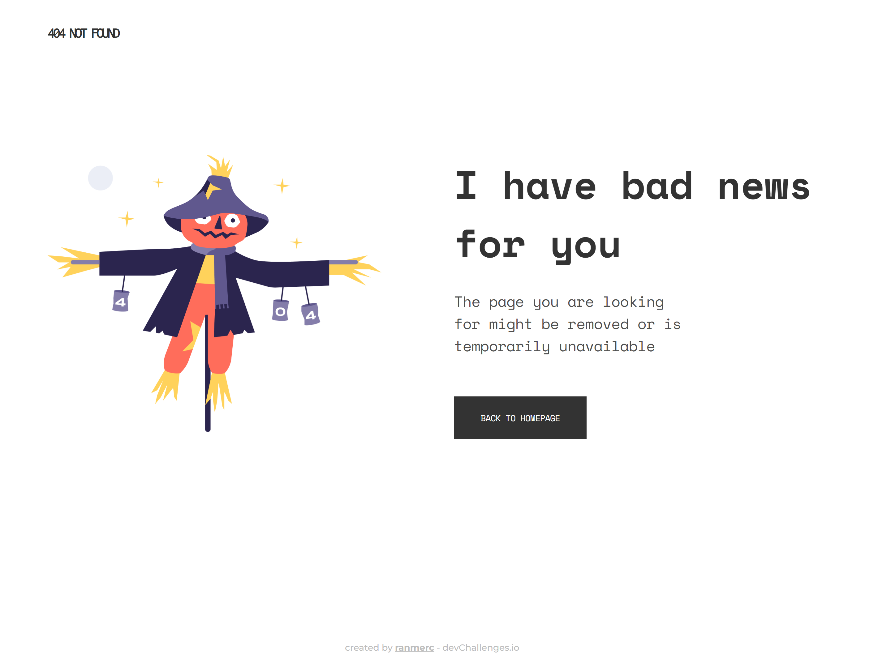
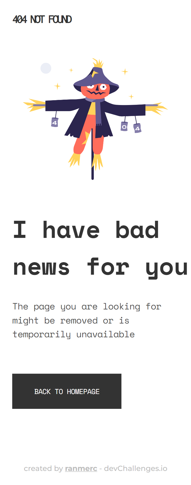

<!-- Please update value in the {}  -->

<h1 align="center">404 Not Found</h1>

   Solution for a challenge from  <a href="http://devchallenges.io" target="_blank">Devchallenges.io</a>.

  <h3>
    <a href="https://ranmerc.github.io/devchallenges-challenges/404-not-found/">
      Demo
    </a>
     | 
    <a href="https://github.com/ranmerc/devchallenges-challenges/tree/main/404-not-found">
      Solution
    </a>
     | 
    <a href="https://devchallenges.io/challenges/wBunSb7FPrIepJZAg0sY">
      Challenge
    </a>
  </h3>

<!-- TABLE OF CONTENTS -->

## Table of Contents

- [Overview](#overview)
  - [Screenshots](#screenshots)
  - [Built With](#built-with)
- [Features](#features)
- [Thoughts on Completion](#thoughts-on-completion)
- [Acknowledgements](#acknowledgements)
- [Contact](#contact)

<!-- OVERVIEW -->

## Overview

### Screenshots

### Built With

<!-- This section should list any major frameworks that you built your project using. Here are a few examples.-->

Simple HTML and CSS.

## Features

<!-- List the features of your application or follow the template. Don't share the figma file here :) -->

This application/site was created as a submission to a [DevChallenges](https://devchallenges.io/challenges) challenge. The [challenge](https://devchallenges.io/challenges/wBunSb7FPrIepJZAg0sY) was to build an application to complete the given user stories.

## Thoughts on Completion

I followed the mobile first approach here. Design was not perfectly suited for responsiveness but I saw through it. I had to use some tricks to make it look exactly like the designs.

For example the section heading is floating to left and touching the edge disregarding any margin on parent, so here I had to do a width of `calc(100vw - 1.5rem)` where `1.5rem` is the margin of parent. Further adding an `overflow: visible` to the parent so that the overflowing section heading would be visible.

While its responsive enough and looks exactly the same as the design described, I would like to learn some responsive typography and improve the look on viewports its not originally designed for (achieve true responsiveness).

## Acknowledgements

<!-- This section should list any articles or add-ons/plugins that helps you to complete the project. This is optional but it will help you in the future. For example -->

- [How to add images to README.md on GitHub?](https://stackoverflow.com/questions/14494747/how-to-add-images-to-readme-md-on-github)

## Contact

- GitHub [@ranmerc](https://github.com/ranmerc)
- Twitter [@ranmerc](https://twitter.com/ranmerc)
