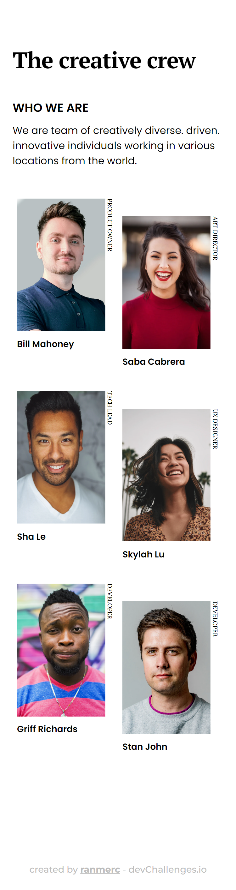

<!-- Please update value in the {}  -->

<h1 align="center">My team page</h1>

   Solution for a challenge from  <a href="http://devchallenges.io" target="_blank">Devchallenges.io</a>.

  <h3>
    <a href="https://ranmerc.github.io/devchallenges-challenges/my-team-page/">
      Demo
    </a>
     | 
    <a href="https://github.com/ranmerc/devchallenges-challenges/tree/main/my-team-page">
      Solution
    </a>
     | 
    <a href="https://devchallenges.io/challenges/hhmesazsqgKXrTkYkt0U">
      Challenge
    </a>
  </h3>

<!-- TABLE OF CONTENTS -->

## Table of Contents

- [Overview](#overview)
  - [Screenshots](#screenshots)
  - [Built With](#built-with)
- [Features](#features)
- [Thoughts on Completion](#thoughts-on-completion)
- [Acknowledgements](#acknowledgements)
- [Contact](#contact)

<!-- OVERVIEW -->

## Overview

### Screenshots

### Built With

<!-- This section should list any major frameworks that you built your project using. Here are a few examples.-->

Simple HTML and CSS.

## Features

<!-- List the features of your application or follow the template. Don't share the figma file here :) -->

This application/site was created as a submission to a [DevChallenges](https://devchallenges.io/challenges) challenge. The [challenge](https://devchallenges.io/challenges/hhmesazsqgKXrTkYkt0U) was to build an application to complete the given user stories.

## Thoughts on Completion

Main thing here was to know about `writing-mode` and `:nth-of-type` selector. Apart from that there were some accessibility concerns which I hopefully think I fixed by using proper semantic HTML.

## Acknowledgements

<!-- This section should list any articles or add-ons/plugins that helps you to complete the project. This is optional but it will help you in the future. For exmpale -->

- HTML5 multiple \<figcaption\> inside \<figure\> on [StackOverflow](https://stackoverflow.com/a/28479033/10469084)
- [Hide content](https://www.a11yproject.com/posts/how-to-hide-content/)
- [W3.org Validator](https://validator.w3.org/nu)
- [Auto-Sizing Columns in CSS Grid: `auto-fill` vs `auto-fit`](https://css-tricks.com/auto-sizing-columns-css-grid-auto-fill-vs-auto-fit/)
- white-space on [MDN](https://developer.mozilla.org/en-US/docs/Web/CSS/white-space)
- writing-mode on [MDN](https://developer.mozilla.org/en-US/docs/Web/CSS/writing-mode)

## Contact

- GitHub [@ranmerc](https://github.com/ranmerc)
- Twitter [@ranmerc](https://twitter.com/ranmerc)
